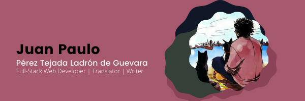

### Hello, World! :nerd_face:

I'm Juan Paulo, but you can call me just *J.P.*. I'm currently learning Full-Stack Web Development at Microverse ([highly recommended](https://www.microverse.org/?grsf=6h9fw6)). I'm also bootstrapping an EdTech Startup ([check here](https://daiuk.com.mx)). 

**My goal is to develop innovative learning materials for high school students and shorten the achievement gap in Latin America.**

### My Background

I studied Linguistics at National School of Anthropology and History and Sociology at National Autonomous University of Mexico. It could sound that I did a career shift into Web Development, but I didn't. My pregraduate research work was about the language policies in the education system of Mexico. Now I'm learning Web Development because I considerer it as a powerful tool to deliver better policies in the education system.

### My Projects

**Right now, my main project is the company that I founded: Daiuk.*
*
I showcase my Full-Stack Web Development projects [here](http://juanpaulo.xyz).

I'm also a sporadical contributor of cultural magazines as [Nexos](https://cultura.nexos.com.mx/author/juan-paulo-perez-tejada/); and a regular contributor of tech-related blogs such as [Developerz.software](http://developez.software) and [Latinamerica.tech](http://latinamerica.tech).

I have in the draft a novel and a book of short stories. I would like to have one day a long vacation to finish that books.

### My hobbies

 I love writing, but I have had time to write for pleasure lately. I even won second place in a short stories contest! (if you read in Spanish, I hope you can [enjoy it](http://www.puntodepartida.unam.mx/index.php/1087-no-0203/1918-0203-la-cronica-como-antidoto-las-batallas-en-xoco-juan-paulo-perez-tejada). 

I like to read science fiction, realism, and pop-science books. 📚

For a long time, my favorite sport was chess. But as I spend a lot of time in a chair, I rarely play chess now. My current hobbies are riding the bicycle and running. However, I am always ready for a chess match!  🦾

### My favorite things

<code> 1 const person = new class Friend(smart, creative, funny);  :person:

2 // I don't match with hateful people that doesn't respect diversity  :rage:

3                                                      

4 const pet = new class Cat(cute, furry, needy);  :heart_eyes_cat:

5 // However, I also love dogs  :dog:

6                                                     

7 const brew = new class Coffee(bitter, strong, dark)  :coffee:

8 // But sometimes I prefer a cup of tea   :tea:

</code>
### Contact Info

You can reach me through [Twitter]() or [LinkedIn]() or here, in GitHub (I guess that you don't need a link for that :smiley:)

I would like to share my email, but I am afraid of evil robots :evil: :robot:

<!--
**Maclenn77/Maclenn77** is a ✨ _special_ ✨ repository because its `README.md` (this file) appears on your GitHub profile.

Here are some ideas to get you started:

- 🔭 I’m currently working on ...
- 🌱 I’m currently learning ...
- 👯 I’m looking to collaborate on ...
- 🤔 I’m looking for help with ...
- 💬 Ask me about ...
- 📫 How to reach me: ...
- 😄 Pronouns: ...
- ⚡ Fun fact: ...
-->
